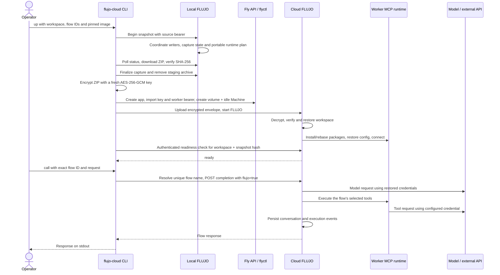

# FLUJO cloud-worker architecture

The feature runs an existing FLUJO workspace in a private cloud Machine. FLUJO captures durable workspace state, restores it on Linux, rebuilds portable MCP runtimes with its existing package installers, and executes the same flows through its existing execution engine.

There are two repositories:

| Repository | Responsibility |
|---|---|
| [mario-andreschak/FLUJO](https://github.com/mario-andreschak/FLUJO) | Workspace snapshot API, portable MCP installation plans, credential capture, worker restore/bootstrap, models, conversations and the ExecutionEngine. Its Dockerfile produces the worker image. |
| [flujo-app/flujo-cloud](https://github.com/flujo-app/flujo-cloud) — this private repository | Node.js CLI that captures from local FLUJO, encrypts the transfer, provisions Fly resources, calls worker flows and removes owned deployments. It also contains the three-worker example. |

The bridge has no npm runtime dependencies. It invokes FLUJO's APIs and Fly tooling; it does not implement another execution engine or an independent MCP installer. Deployment is currently CLI-driven. The bridge does not build images, provide a fleet dashboard, schedule recurring work or synchronize later workspace changes.

## Deployment diagram

[Editable Mermaid source](diagrams/deployment.mmd). Dashed arrows describe provisioning/bootstrap; the heavy arrows show flow dispatch. The three workers are separate deployments, each with its own Fly app, Machine and persistent volume. A single-worker deployment uses the same structure with one worker.

The bridge opens a temporary local loopback proxy to the specific Machine's private address. The apps have no public Fly services or allocated public IPs. Worker requests also require the worker control bearer. Workers make outbound connections to their configured model providers, package repositories and MCP services.

## Capture, restore and execution

Capture uses `/api/snapshot/begin`, `/status`, `/download` and `/finalize`; unsuccessful captures attempt `/abort`. These paths are under `/api/snapshot/`. The source runs on the same computer as the bridge and is addressed through loopback HTTP(S).

The source stages a **plaintext ZIP** in a restricted temporary directory; finalize, abort and expiry remove its staging state. After download, the bridge verifies the hash and writes only an **encrypted envelope** to its own temporary directory. The fresh envelope key goes to Fly secrets separately. The cloud worker authenticates and decrypts the envelope, validates the archive, and restores into `/data/flujo/workspaces/<workspace>`.

`/api/worker/status` reports `ready` only after bootstrap and required MCP connection checks. The bridge also checks the requested workspace, archive hash, Machine ownership and actual image digest. A subsequent representative flow call is the end-to-end model/tool test; readiness alone does not prove the model subscription works.

## What moves

| State or dependency | Cloud behavior |
|---|---|
| Workspace flows, model definitions, conversations and execution records | Durable workspace files are captured and restored. FLUJO's workspace database here is JSON/JSONL; this is not a SQLite database-copy mechanism. |
| Userdata and other permitted workspace files | Captured as allowed by the snapshot format. Cloud changes persist on that worker's volume. |
| Secret MCP env values, headers, provider credentials and supported workspace encryption material | Included in the protected workspace transfer. Secret env metadata and encryption are preserved by the existing MCP configuration path. |
| Bundled MCPs | Resolved from the Linux FLUJO image's bundled packages. |
| Supported installed GitHub MCPs | A portable plan records the actual clean local Git commit; the existing installer rebuilds the Node server at a Linux workspace location. |
| `npx` / `uvx` servers | Package-runner configuration is retained and used on the worker. Pin package versions explicitly; an unversioned argument does not become pinned automatically. |
| Remote MCP endpoints | URL and supported authentication configuration transfer. The remote server process stays where it already runs. |
| Local `node_modules`, platform-specific installations and running processes | Recreated where supported; they are not migrated as live processes or copied Windows installations. |
| Browser profiles, Python virtual environments and Codex internal runtime databases | Excluded. Included data files with a live SQLite signature are rejected rather than copied as if they were portable durable state. |
| Arbitrary OS keyrings, desktop sessions, local listeners and external filesystem roots | Not transferred. Required nonportable dependencies fail capture/bootstrap or need explicit cloud-compatible configuration. |
| In-flight work and later local edits | Not moved or synchronized. This is a fork of durable state, not a live VM migration. |

Snapshot coordination covers registered FLUJO writers. Quiesce tools and external processes that write directly into workspace files while capturing. For parallel deployment, keep the source configuration unchanged between the sequential captures.

The package integration reuses installation origins and runtime helpers while preserving the original workspace entity IDs and configuration. It does not re-import the flows, models and conversations through the package-import wizard.

`--flow` selects dependency/startup scope, disables unrelated MCPs in the exported configuration and restricts which flow IDs the bridge's `call` accepts. **It does not redact unrelated workspace data or credentials and is not an authorization boundary.** Use a dedicated workspace when only a particular set of data and credentials should reach the cloud.

## Credentials and trust boundaries

| Credential | Where it is used |
|---|---|
| Source `FLUJO_SNAPSHOT_CONTROL_TOKEN` | Authenticates the bridge to the local snapshot API. |
| Bridge `FLUJO_CLOUD_CONTROL_TOKEN` | Separate worker bearer. Imported to the app as the worker's `FLUJO_SNAPSHOT_CONTROL_TOKEN`; retained locally for future `call` requests. |
| Fresh snapshot encryption key | Generated per deployment and delivered through Fly secrets as `FLUJO_WORKER_SNAPSHOT_KEY`; absent from the journal. |
| Existing Fly login / `FLY_API_TOKEN` | Used by the controller to provision and access Fly; not installed as a workspace credential. |
| MCP and model credentials | Restored with the selected workspace and consumed by the worker's normal adapters/MCP configuration. |
| Optional `FLUJO_GITHUB_AUDIT_TOKEN` | Used by the three-worker example locally for read-only GitHub verification. Worker comments are created through MCP using the separately configured workspace credential. |

The snapshot contains sensitive workspace state, including material needed to use its credentials. The cloud app and volume therefore belong inside the same trust boundary as the source workspace. Encryption of env values at rest does not prevent an authorized worker process from using/decrypting them.

### Codex subscription authentication

FLUJO captures supported file-backed Codex ChatGPT authentication into its managed workspace runtime. The worker's `db/codex-runtime/auth.json` carries the supported access/refresh credentials and is restricted to owner access (`0600` on Linux). FLUJO's Codex adapter then uses that managed runtime for the model call. No Codex API key is needed for this path.

This does **not** export arbitrary Windows Credential Manager/macOS Keychain entries. Explicit Codex `keyring` or `auto` storage modes are rejected, even when a leftover `auth.json` exists. Profile-based, missing or ambiguous/stale credential sources are unsupported instead of being treated as a valid cloud login. A valid file-backed, unprofiled local login is a deployment prerequisite; the local and cloud flow calls verify it actually works.

The [three-worker live test](github-mcp-validation-2026-09-05.md) demonstrated concurrent use of the copied login. It does not guarantee independent long-term refresh: clones share refresh credentials and can interfere when credentials rotate. A separate login or coordinated credential lifecycle for each long-running worker is not implemented by this bridge.

## Persistence, ownership and limits

A worker's volume stores its restored workspace, later conversations/results and the encrypted snapshot. A restart recognizes the matching restore marker and preserves the worker's changed durable state; it does not reset the workspace from the original snapshot. Bootstrap checks/reconnects the MCP runtimes. Running calls are not live-migrated or guaranteed to resume across a crash.

Each deployment journal stores identities, an ownership marker and hashes, not credential values. `down` verifies the app marker, Machine and volume before deleting the dedicated app. Extra or mismatched resources stop deletion. Journals and control tokens must be retained until a deployment is retired.

The current bridge targets Fly Machines, one Machine and one volume per deployment. Parallelism uses separate deployments. It has no automatic scaling, result merge-back, perpetual credential renewal or automatic replay of uncertain requests. The three-worker example separately guards against replay with durable call reservations and comment-marker audits.

Implementation entry points: [bridge lifecycle](../lib/bridge.mjs), [snapshot client](../lib/snapshot.mjs), [envelope encryption](../lib/envelope.mjs), [Machine creation](../lib/machines.mjs), [FLUJO snapshot coordinator](https://github.com/mario-andreschak/FLUJO/blob/main/src/backend/services/workspace/snapshotCoordinator.ts), [worker restore](https://github.com/mario-andreschak/FLUJO/blob/main/src/backend/services/workspace/snapshotRestore.ts).

Continue with the [deployment and operations guide](deployment.md).
